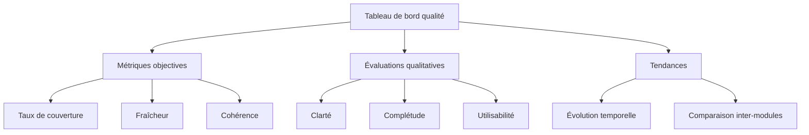

# Métriques de Qualité Documentaire

Ce document définit les mesures quantitatives et qualitatives permettant d'évaluer l'efficacité de notre documentation.

## Métriques objectives

| Métrique | Description | Méthode de mesure | Cible |
|----------|-------------|-------------------|-------|
| **Taux de couverture** | Proportion des fonctionnalités documentées | Nombre de fonctionnalités documentées / nombre total | ≥ 95% |
| **Concision** | Économie de mots sans perte d'information | Nombre moyen de mots par concept documenté | Optimal selon complexité |
| **Fraîcheur** | Synchronisation avec le code actuel | Délai entre modification code et documentation | ≤ 7 jours |
| **Cohérence** | Absence de contradictions inter-documents | Nombre d'incohérences détectées par audit | 0 |
| **Accessibilité** | Facilité de navigation et recherche | Temps moyen pour trouver une information | ≤ 2 minutes |

## Évaluation qualitative

Grille d'évaluation à utiliser lors des revues documentaires périodiques :

### Clarté et précision

| Critère | 1 (Insuffisant) | 3 (Acceptable) | 5 (Excellent) |
|---------|-----------------|----------------|---------------|
| **Langage** | Termes ambigus ou jargon non défini | Terminologie majoritairement claire | Formulations précises et cohérentes |
| **Structure** | Organisation confuse | Structure logique mais perfectible | Hiérarchisation intuitive et efficace |
| **Contextualisation** | Manque éléments de contexte essentiels | Contexte présent mais incomplet | Parfaite mise en contexte des informations |
| **Exemples** | Exemples absents ou inadaptés | Quelques exemples pertinents | Exemples clairs et représentatifs |

### Complétude et proportionnalité

| Critère | 1 (Insuffisant) | 3 (Acceptable) | 5 (Excellent) |
|---------|-----------------|----------------|---------------|
| **Détail** | Niveau inadapté à la complexité | Détail généralement approprié | Détail parfaitement adapté à chaque composant |
| **Scénarios** | Cas principaux uniquement | Majorité des cas couverts | Tous les cas pertinents documentés |
| **Limites** | Absence des contraintes et limites | Limites principales mentionnées | Documentation exhaustive des contraintes |
| **Interfaces** | Interfaces imprécises ou incomplètes | Interfaces documentées mais sans détails | Documentation complète des interfaces |

## Processus d'évaluation documentaire

### Fréquence d'évaluation

- **Évaluation automatisée** : Hebdomadaire (métriques objectives)
- **Auto-évaluation** : À chaque livraison documentaire
- **Revue par les pairs** : Mensuelle
- **Audit complet** : Trimestriel

### Méthodologie d'audit

1. **Échantillonnage représentatif** : Sélection de documents de différentes catégories
2. **Vérification croisée** : Contrôle de cohérence entre documents interdépendants
3. **Test utilisateur** : Évaluation du temps de recherche par différents profils
4. **Revue technique** : Validation de la synchronisation avec le code source
5. **Enquête satisfaction** : Retour des utilisateurs sur l'utilité et la clarté

## Tableau de bord de qualité documentaire

Le tableau de bord est mis à jour automatiquement après chaque évaluation et accessible à toute l'équipe projet pour maintenir une transparence sur la qualité de notre documentation.

## Actions correctives

Pour chaque métrique en dessous des cibles définies, des actions spécifiques sont déclenchées :

1. **Taux de couverture < 95%** : Session de documentation ciblée sur les composants manquants
2. **Délai de fraîcheur > 7 jours** : Revue du processus de mise à jour et formation de l'équipe
3. **Incohérences > 0** : Atelier de réconciliation documentaire
4. **Score qualitatif < 3** : Révision complète des documents concernés selon grille d'évaluation 