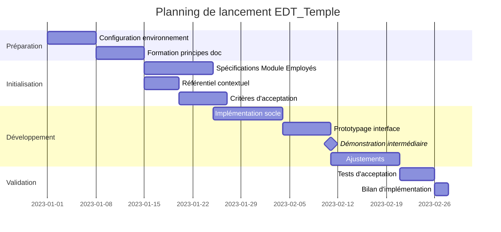

# Plan de Démarrage du Projet

Ce document détaille les activités concrètes pour lancer efficacement le projet EDT_Temple en s'appuyant sur le référentiel documentaire établi.

## Calendrier de lancement

| Phase | Activités | Durée | Livrable |
|-------|-----------|-------|----------|
| **Préparation** | Configuration environnement, formation équipe | 2 semaines | Environnement opérationnel |
| **Initialisation** | Spécifications détaillées du premier module | 3 semaines | Backlog priorisé |
| **Première itération** | Développement du socle technique | 4 semaines | Prototype fonctionnel |
| **Validation initiale** | Tests et ajustements | 1 semaine | Premier module validé |

## Répartition des rôles initiaux

| Rôle | Responsabilités principales | Interactions documentaires |
|------|----------------------------|----------------------------|
| **Product Owner** | Validation des priorités fonctionnelles | Vision, spécifications, critères d'acceptation |
| **Architecte technique** | Design technique global | Architecture, matrices, référentiels |
| **Développeurs** | Implémentation conforme | Spécifications, référentiels, bilans |
| **Documentaliste technique** | Cohérence documentaire | Transverse sur tous les documents |
| **Coordinateur de qualité** | Vérification des critères | Critères, tests, métriques |

## Plan de mise en œuvre documentaire

### Semaine 1-2 : Initialisation documentaire
- Création des espaces de travail Obsidian et Cursor
- Configuration du système de versionnement
- Établissement des templates de documents
- Formation de l'équipe aux principes documentaires

### Semaine 3-4 : Cadrage détaillé du premier module
- Développement détaillé des spécifications fonctionnelles
- Établissement des critères d'acceptation spécifiques
- Construction du référentiel contextuel initial
- Préparation du plan de tests d'acceptation

### Semaine 5-8 : Démarrage du développement
- Mise en place de l'environnement technique
- Développement initial selon les spécifications
- Premières revues de code documentées
- Premières réconciliations documentation-implémentation

### Semaine 9 : Validation et rétrospective
- Exécution des tests d'acceptation
- Documentation des écarts et résolutions
- Mise à jour des documents de référence
- Ajustement du processus pour les prochaines itérations

## Indicateurs de suivi initial



## Points d'attention au démarrage

1. **Cohérence initiale des documents** : S'assurer que l'ensemble documentaire est cohérent dès le départ
2. **Adhésion de l'équipe** : Vérifier que tous les membres comprennent et adhèrent à l'approche
3. **Équilibre documentation/développement** : Ne pas sur-documenter au détriment de l'avancement
4. **Flexibilité des processus** : Être prêt à adapter les mécanismes selon les retours terrain
5. **Capitalisation des connaissances** : Mettre en place dès le début les pratiques de partage

## Ateliers de lancement

1. **Atelier vision** : Partage et compréhension commune des objectifs stratégiques (1 jour)
2. **Atelier architecture** : Exploration collaborative de l'architecture système (2 jours)
3. **Atelier workflows** : Pratique des mécanismes de travail et documentation (1 jour)
4. **Atelier métriques** : Définition collective des indicateurs de succès (0,5 jour) 

## Tags pour la documentation

```
tags:
  - type/[specification|implementation|rapport|decision|documentation]
  - module/[nom-du-module]
  - statut/[planifie|en-cours|termine|archive]
  - priorite/[haute|moyenne|basse]
  - version/[numero-version]
``` 

## Références
- Parent: [[document-parent]]
- Documents connexes: [[doc1]], [[doc2]]
- Implémentations: [[implementation1]], [[implementation2]] 

# MOC: EDT_Temple

## Vision et Fondements
- [[1-Vision-et-charte/objectifs-du-projet]]
- [[1-Vision-et-charte/principes-directeurs]]
- [[1-Vision-et-charte/glossaire]]

## Architecture
- [[2-Architecture-systeme/vue-globale]]
- [[2-Architecture-systeme/composants-techniques]]

## Modules Fonctionnels
- [[MOC-Gestion-Employés]]
- [[MOC-Gestion-Bars]]
- [[MOC-Planification]]
- [[MOC-Communication]]
- [[MOC-Analyse]]

## Développement
- [[MOC-Implementation]]
- [[MOC-Suivi]]

## Aide et Références
- [[guide-documentation]]
- [[standards-de-codage]] 