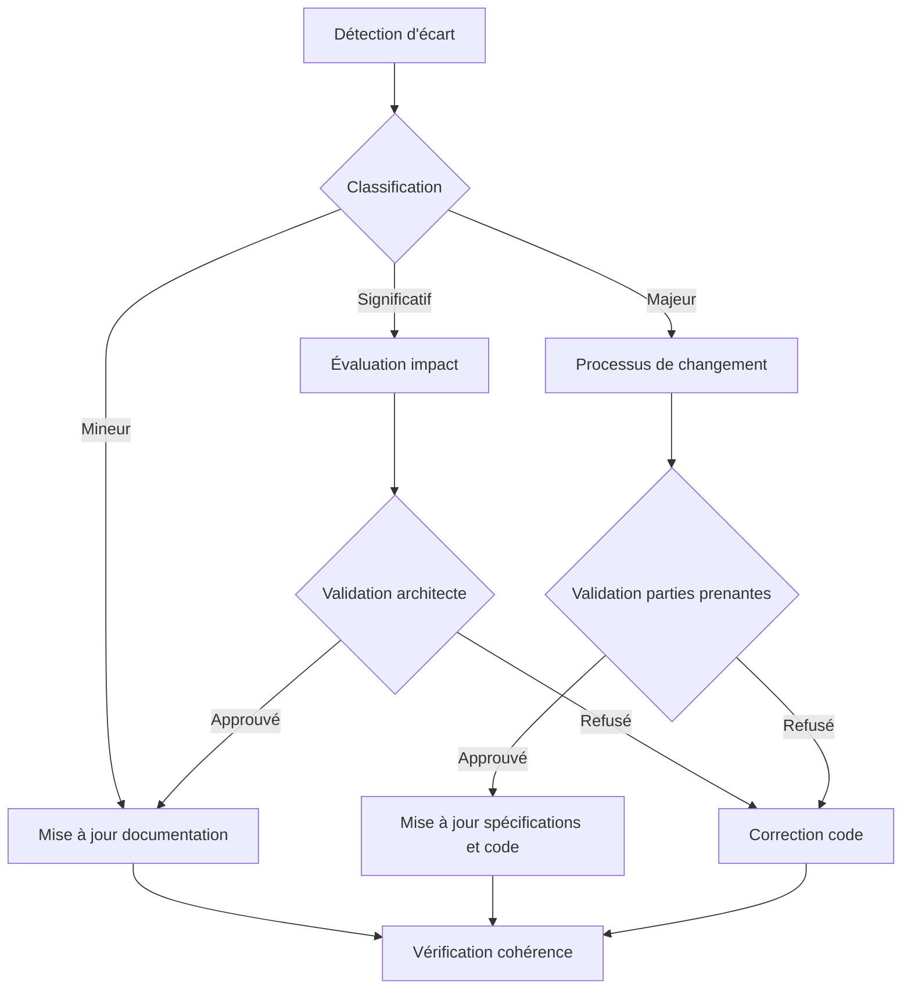

# Mécanisme de Réconciliation

Le mécanisme de réconciliation assure la synchronisation permanente entre les spécifications documentées et l'implémentation réelle, préservant ainsi l'intégrité du référentiel documentaire tout au long du cycle de vie du projet.

## Principes fondamentaux

1. **Source unique de vérité** : Les spécifications validées constituent la référence
2. **Adaptabilité contrôlée** : Les ajustements nécessaires sont documentés et validés
3. **Traçabilité intégrale** : Tout écart est justifié et consigné
4. **Convergence continue** : Réduction progressive des écarts documentation/implémentation

## Processus de réconciliation

### 1. Détection des écarts

- **Revues de code** systématiques comparant implémentation et spécifications
- **Audits périodiques** des fonctionnalités implémentées
- **Analyse automatisée** du code pour validation des interfaces

### 2. Classification des écarts

- **Écart mineur** : N'affecte pas le comportement global ou les interfaces
- **Écart significatif** : Modifie le comportement mais respecte les critères d'acceptation
- **Écart majeur** : Déviation importante nécessitant révision des spécifications

### 3. Traitement des écarts

- **Écart mineur** : Documentation mise à jour sans validation spécifique
- **Écart significatif** : Évaluation d'impact et validation par l'architecte
- **Écart majeur** : Processus formel de changement avec validation des parties prenantes

### 4. Mise à jour documentaire

- **Spécifications fonctionnelles** : Ajustement des comportements documentés
- **Architecture système** : Révision des diagrammes et flux de données
- **Matrices de dépendances** : Actualisation des relations inter-composants
- **Critères d'acceptation** : Modification des indicateurs de validation

## Fréquence de réconciliation

- **Réconciliation continue** : Pour les écarts mineurs (hebdomadaire)
- **Réconciliation périodique** : Pour les écarts significatifs (mensuelle)
- **Réconciliation exceptionnelle** : Pour les écarts majeurs (à la demande)

## Rôles et responsabilités

- **Développeurs** : Signalement des écarts détectés lors de l'implémentation
- **Architecte technique** : Évaluation et approbation des écarts significatifs
- **Chef de projet** : Coordination du processus pour les écarts majeurs
- **Documentaliste technique** : Mise à jour formelle de la documentation

## Workflow de réconciliation



## Formulaire de demande de réconciliation

Pour les écarts significatifs et majeurs, un formulaire standardisé doit être complété :

```yaml
id: REC-YYYY-MM-XXX
date_detection: YYYY-MM-DD
fonctionnalite_concernee: ID-XXX
type_ecart: Significatif/Majeur
description_ecart: |
  Description détaillée de l'écart observé entre la spécification et l'implémentation
justification: |
  Raisons techniques ou fonctionnelles justifiant cet écart
impact: |
  - Impact sur les autres composants
  - Impact sur les critères d'acceptation
  - Impact sur le planning
solution_proposee: |
  Description détaillée de la modification documentaire ou technique proposée
validateur: Nom du responsable de validation
``` 