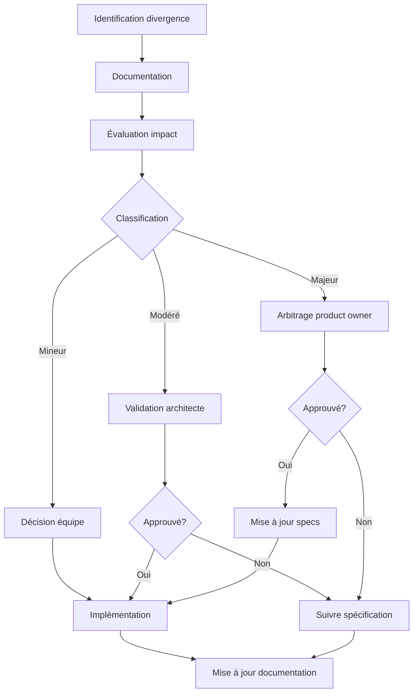

# Gestion Des Divergences

En cas de divergence entre la spécification et l'implémentation optimale identifiée pendant le développement, un processus structuré est mis en place pour gérer ces écarts de manière efficace et transparente.

## Principes directeurs

1. **Pragmatisme technique** : L'implémentation doit rester réaliste et efficiente
2. **Respect des objectifs** : Les déviations ne doivent pas compromettre les objectifs métier
3. **Documentation systématique** : Tout écart doit être documenté avec sa justification
4. **Validation à niveau approprié** : Le niveau de validation dépend de l'impact du changement

## Processus de gestion des divergences

### 1. Documentation immédiate de la divergence constatée

Dès qu'un développeur identifie un écart potentiel entre la spécification et l'implémentation optimale:

- Renseigner un rapport de divergence dans l'outil de suivi
- Documenter la nature précise de l'écart
- Référencer les spécifications concernées
- Notifier l'architecte technique

#### Formulaire type de rapport de divergence:

```yaml
id: DIV-YYYY-MM-XXX
date_detection: YYYY-MM-DD
developpeur: Nom du développeur
fonctionnalite: ID-XXX
specification_concernee: Référence au document
nature_divergence: |
  Description précise de la divergence entre spécification et implémentation optimale
```

### 2. Évaluation d'impact sur les autres composants et le planning

L'architecte technique procède à une évaluation structurée:

- Analyse des dépendances impactées
- Évaluation des risques techniques
- Estimation de l'impact sur le planning
- Classification du niveau d'impact (mineur, modéré, majeur)

#### Matrice de classification d'impact:

| Niveau | Impact fonctionnel | Impact technique | Impact planning |
|--------|-------------------|-----------------|----------------|
| Mineur | Imperceptible pour l'utilisateur | Limité à un composant | Aucun impact |
| Modéré | Modification du comportement mais fonctionnalité préservée | Impacts sur plusieurs composants | Retard < 1 itération |
| Majeur | Modification significative du comportement | Impacts architecturaux | Retard ≥ 1 itération |

### 3. Proposition argumentée de la solution alternative

Le développeur prépare une proposition complète:

- Description détaillée de l'approche alternative
- Justification technique et/ou fonctionnelle
- Comparaison avantages/inconvénients vs. spécification
- Plan d'implémentation de la solution alternative

#### Structure de la proposition alternative:

1. **Solution proposée**: Description technique détaillée
2. **Avantages**: Liste des bénéfices apportés
3. **Inconvénients**: Limitations ou compromis nécessaires
4. **Compatibilité**: Impacts sur les interfaces existantes
5. **Effort**: Estimation du travail d'implémentation

### 4. Processus décisionnel adapté au niveau d'impact

#### Impact mineur:
- Décision au niveau de l'équipe technique
- Documentation de la décision dans le rapport de développement
- Mise à jour de la documentation technique

#### Impact modéré:
- Validation par l'architecte technique
- Notification au product owner
- Mise à jour des spécifications fonctionnelles
- Documentation dans le registre des décisions techniques

#### Impact majeur:
- Présentation formelle au product owner
- Arbitrage avec les parties prenantes
- Révision des spécifications et du planning
- Mise à jour complète de la documentation

## Workflow de décision

