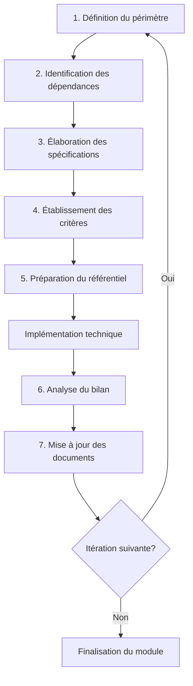

# Processus Itératif

La méthodologie collaborative définit le cadre de travail permettant d'assurer la cohérence entre la documentation stratégique et l'implémentation technique tout au long du projet.

## Vue d'ensemble du processus itératif

Pour chaque composant du système EDT_Temple, nous suivrons un processus itératif structuré garantissant à la fois l'alignement avec la vision du projet et la flexibilité nécessaire à l'évolution des besoins.

## Étapes détaillées du processus

### 1. Définition du périmètre fonctionnel

- **Identification précise** du sous-ensemble de fonctionnalités à développer
- **Délimitation claire** des frontières avec les autres composants
- **Articulation explicite** avec les objectifs stratégiques du projet
- **Validation collégiale** du périmètre par les parties prenantes

#### Livrables:
- Document de périmètre fonctionnel
- Liste des fonctionnalités concernées (IDs)
- Matrice d'impact sur les autres composants

### 2. Identification des dépendances et contraintes

- **Cartographie** des interactions avec les composants existants
- **Analyse préalable** des impacts techniques sur l'architecture
- **Inventaire exhaustif** des contraintes non fonctionnelles applicables
- **Évaluation des risques** techniques et opérationnels

#### Livrables:
- Matrice de dépendances spécifique
- Liste des contraintes à respecter
- Registre des risques identifiés

### 3. Élaboration des spécifications détaillées

- **Rédaction collaborative** des comportements attendus
- **Formalisation** des interfaces et contrats de services
- **Définition** des scénarios principaux et alternatifs
- **Documentation** des cas limites et comportements d'erreur

#### Livrables:
- Spécifications détaillées
- Diagrammes d'interfaces
- Scénarios de tests

### 4. Établissement des critères de validation

- **Formulation** d'indicateurs mesurables et vérifiables
- **Conception** des jeux de tests représentatifs
- **Définition** des seuils d'acceptabilité pour chaque critère
- **Validation croisée** des critères par développeurs et testeurs

#### Livrables:
- Liste des critères d'acceptation
- Plan de tests détaillé
- Matrices de validation

### 5. Préparation du référentiel contextuel

- **Sélection** des informations essentielles à l'implémentation
- **Structuration** du contexte métier et technique
- **Identification** des points de vigilance particuliers
- **Synthèse** des contraintes prioritaires à respecter

#### Livrables:
- Document de contexte d'implémentation
- Guide technique pour l'équipe de développement
- Liste des points de vigilance

### 6. Analyse du bilan d'implémentation

- **Revue systématique** des fonctionnalités développées
- **Évaluation** de la conformité aux spécifications
- **Analyse** des écarts techniques et fonctionnels
- **Documentation** des décisions prises durant l'implémentation

#### Livrables:
- Bilan d'implémentation
- Registre des écarts identifiés
- Documentation des décisions techniques

### 7. Mise à jour des documents de référence

- **Intégration** des modifications validées aux spécifications
- **Actualisation** des diagrammes d'architecture
- **Révision** des matrices de dépendances
- **Enrichissement** des référentiels contextuels

#### Livrables:
- Documents de référence mis à jour
- Traçabilité des modifications
- Notification aux parties prenantes

## Cycle de vie d'une itération

